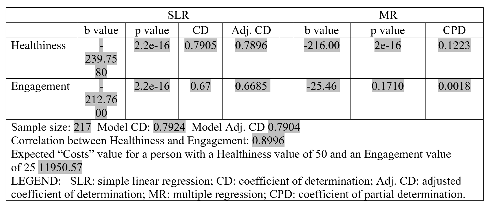

# Decoding Health Program Impact: Confounding Effects, Simpson's Paradox, and Suppressor Effects!
Odnetnin Co., Ltd., a global leader in gaming software, introduced the Employee Comprehensive Health Option (ECHO) Program in 2009 to enhance employee wellness. The program provides employees with 24/7 access to a state-of-the-art onsite fitness center and wellness education programs. To evaluate the program's effectiveness, Odnetnin commissioned a year-long study conducted by a business analytics firm. The study utilized a random sample of employees to measure three key variables: (1) Healthiness, assessed on a scale from 0 (very unhealthy) to 100 (very healthy); (2) Engagement in ECHO activities over the past year, rated from 0 (not engaged) to 100 (highly engaged); and (3) Health-Related Costs, encompassing illness-related absences, insurance premiums, and company-paid medical expenses. The data were collected from March 2016 to March 2017 and are stored in the file named Odnetnin.dat. This repository investigates whether increased engagement in the ECHO program directly reduces health-related costs (the “direct effect hypothesis”) or if healthier individuals, being more engaged, drive the observed relationship and incur lower costs (the “confounding hypothesis”). Using simple and multiple regression analyses, it uncovers key phenomena such as confounding effects, Simpson’s paradox, and suppressor effects in health cost predictions. The analysis emphasizes predictor interactions and offers practical insights, supported by detailed R code for replication.

## Basic Information
**Names:** N M Emran Hussain  
**Email:** nmemranhussain2023@gmail.com  
**Date:** October 2024  
**License:** [MIT License](LICENSE)

## Intended Use
**Purpose:**  
This repository aims to investigate and demonstrate the role of correlation between independent variables in regression analysis. Key objectives include:  
- **Exploring Confounding Effects:** Analyze how the correlation between independent variables affects their relationships with the dependent variable in both bivariate and multivariate contexts.  
- **Examining Predictor Interplay:** Highlight the influence of highly correlated predictors (e.g., healthiness and engagement) on regression outcomes, focusing on their direct versus mediated effects.  
- **Model Evaluation:** Evaluate the impact of correlation on simple and multiple regression models, including coefficients, significance, and explanatory power (e.g., adjusted R-squared, partial determination).  
- **Practical Insights:** Provide a framework for identifying and interpreting confounding hypotheses in real-world datasets, emphasizing the distinction between direct causality and mediated associations.  
- **Statistical Application:** Use R to model, visualize, and explain the interplay between variables, reinforcing practical skills in regression analysis for applied research.  
- **Confidence level:** All results are reported with a minimum precision of four decimal places, using an alpha level of 0.05 for statistical tests.  

**Intended Users:**
- Data Analysts, Data scientists, machine learning enthusiasts, educators.

**Out-of-scope Uses:**
- The model is not intended for production use in any critical applications or real-time decision-making systems.

## Data Description
- This dataset pertains to a study on the effectiveness of the ECHO Program conducted by Odnetnin Co., Ltd, a multinational gaming software company. Below is a detailed description of the variables:

| **Variable Name**  | **Model Role** | **Measurement Level**  | **Description**                                     |
|--------------------|----------------|------------------------|-----------------------------------------------------|
| Engagement         | Independent    | Ratio                  | Engagement score on a scale from 0 to 100.          |
| Happiness          | Independent    | Ratio                  | Happiness score on a scale from 0 to 100            |
| Costs              | Dependent      | Ratio                  | Medical premium costs in USD.                       |

- Sample Size: 217 employees.  
- Dataset File: Odnetnin.dat  
- File Format: .dat (space-separated values) with headers.

## Model Details
### Architecture  
- This model card utilizes linear model such as **'Multiple Regression'**. To understand inght, an alternative model **'Simple Linear Regression'** model is also used.   

### Evaluation Metrics  
- **Coefficient of multiple determination (R²)** - Indicates the strength of relationships in **'sample'**. It is also denoted by CD.
- **Adjusted R²** - Indicates the strength of relationships in **'population'**. It is also denoted by Adjusted CD.
- **Coefficient of partial determination (CPD)** - Indicates what portion of each independent variables can explain the 'Streaming Hours'.
- **Unconditional P-value** - Indicates statistical significance in bivariate level (simple regression) using 95% confidence level.
- **Conditional P-value** - Indicates statistical significance in multivariate level (multiple regression) using 95% confidence level.
- **b-value in SLR** - represents the magnitude and direction of **'slope'** of independent variable in a simple regression model.
- **b-value in MLR** - represents the magnitude and direction of **'slope'** of independent variables in a multiple regression model.
- **Global F P-value** - indicates at least one of the predictor variables is statistical-significantly related with dependent variable in 95% confidence level.
  
### Columns Used as Inputs in the Final Model
The following columns were used as inputs (features) in the final model:
- **Healthiness**: Level of healthiness of employees
- **Engagement**: Employee engagement in ECHO activities over years

### Column(s) Used as Target(s) in the Final Model
- **Target Column:** **Costs** (Health-related costs over the past six months)

### Type of Models
* **Simple Regression Classifier**
* **Multiple Regression Classifier**

### Software Used to Implement the Model
- **Software:** R (with libraries such as **deplyr**, **heplots** and **agricolae**)

### Version of the Modeling Software: 
- **R:** 4.3.2
- **deplyr:** 1.1.4
- **heplots:** 1.7.0
- **agricolae:** 1.3.7

## Quantitative Analysis

### Pearson Correlation, Simple (SLR) and Multiple (MR) Regression Analysis table  

  

### Interpretation  

The reason the data supports **'Confounding Hypothesis:'** The data supports the confounding hypothesis over the direct effect hypothesis because 'Engagement' does not demonstrate an independent effect on 'Costs'. In the multiple regression analysis, 'Engagement' can't reasonably assure us the statistically significance (p = 0.171) at the 95% confidence level. Moreover, it doesn't exhibit a strong relationship with 'Costs' (CPD = 0.0018). In a direct effect hypothesis, all independent variables should show a strong and statistically significant relationship with the dependent variable to suggest direct, independent contributions. On the other hand, 'Healthiness' has a relatively strong (CPD = 0.1223) and can reasonably assure us statistically significant (p < 2e-16) relationship with 'Costs' at the 95% confidence level, suggesting that 'Healthiness' is driving the primary relationship with 'Costs'. The high correlation between 'Engagement' and 'Healthiness' (0.8996) implies that 'Engagement' may act as a confounded predictor, indirectly associated with 'Costs' due to its strong association with Healthiness, rather than having an independent, direct effect on Costs.

The reason the data dosn't supports **'Simpson Paradox:'** While Simpson's paradox typically involves a reversal of association direction between bivariate and multivariate analyses, in this case, the direction of the slopes remains consistent across both levels. This lack of reversal indicates that Simpson's paradox is not present in the dataset.

The reason the data dosn't supports **'Suppressor Effect:'** In a suppressor effect, individual independent variables may appear insignificant in bivariate analysis due to high correlation with other predictors. However, when included in a multivariate model, they can become significant as the model accounts for their shared variance. In this case, while both independent variables are significant in bivariate analysis, one becomes insignificant in the multivariate model. This pattern does not align with the characteristics of a suppressor effect, indicating a different underlying relationship between the variables.
